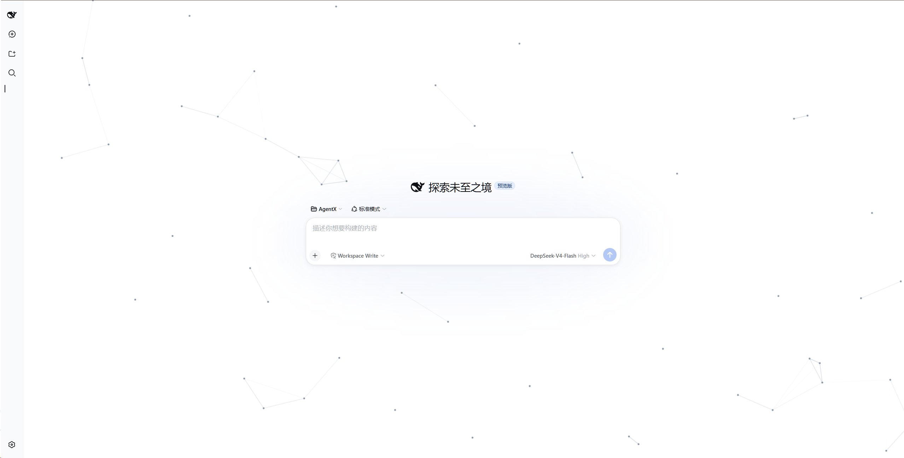
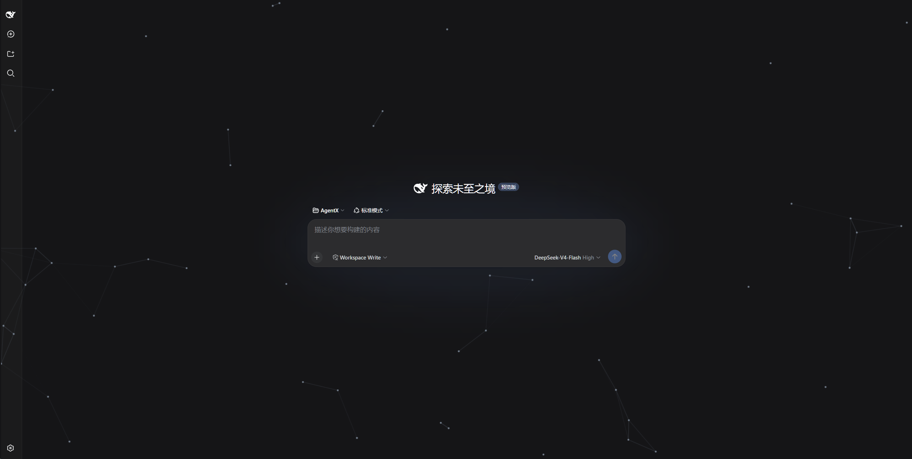

# cyber-particle — Particle Network Background Plugin for DeepSeek Harness

English | [中文](./README.md)

Adds an animated particle-network background to the DeepSeek Harness web UI: gray particles drift in from random screen edges, cross the viewport in straight lines, and re-enter from a new edge after leaving; particles closer than a threshold distance are automatically connected with lines, forming a continuously evolving mesh. It does not change any UI colors and does not affect mouse or keyboard interaction.

> Implementation note: the animation canvas renders inside the `shell.overlay` layer with `pointer-events: none` — purely visual, it never intercepts clicks or scrolling.

Requires the DeepSeek Harness dsh web shell (the client bundle registers through the `__ModuleLoader__` module system); the plugin itself has no npm runtime dependencies.

## Preview

Light theme:



Dark theme:



## Files

| File | Purpose |
| --- | --- |
| `package.json` | Package declaration: `dsh.bundle.patch` (standard bundle mount), `dsh.client.platform: "web"`, `./client` export (consumed by the client-modules scanner) |
| `client.js` | Browser bundle: registers the plugin via `window.__ModuleLoader__.load({ id, factory })`, Canvas particle animation |
| `index.js` | Node half: empty `apply` so the plugin row activates in the host loader |
| `cordis.patch.yml` | Bundle patch layer: mounted automatically by `dsh plugin` as a profile layer |
| `README.en.md` | This document (English) |
| `README.md` | Chinese documentation (primary) |
| `assets/` | Preview screenshots (light / dark theme) |

## Install (standard bundle flow)

This repo is a standard dsh bundle: package.json declares `dsh.bundle.patch`
(`cordis.patch.yml`), so `dsh plugin` adds it to `dsh.profile.bundles`
automatically and the patch layer mounts the plugin row.

```sh
# Option 1: local directory
dsh plugin --profile web add /path/to/dsh-cyber-particle

# Option 2: install from the git repository
dsh plugin --profile web add github:AKS1st/dsh-cyber-particle

# Restart the web service for the profile change to take effect
dsh web
```

`dsh plugin add` runs pnpm inside the profile directory; on detecting the
`dsh.bundle` declaration it appends `cyber-particle` to `dsh.profile.bundles`
and its `cordis.patch.yml` mounts the plugin row as a layer. After the restart
the plugin loads automatically on every startup — no approval needed, and it
survives process restarts.

## Uninstall

```sh
dsh plugin --profile web remove cyber-particle
dsh web
```

## Migrating from the legacy install.sh flow

Early versions were installed by `install.sh`: package files were copied
straight into `$DSH_HOME/profiles/web/node_modules/cyber-particle/` and the
plugin row was hand-written into the profile's `cordis.patch.yml`. To migrate
an existing legacy install to the standard flow:

```bash
# 1. Remove the hand-written cyber-particle row from the profile's user layer
#    (edit $DSH_HOME/profiles/web/cordis.patch.yml) so it does not duplicate
#    the bundle layer
# 2. Delete the old package directory (defaults to ~/.dsh when DSH_HOME is unset)
rm -rf "${DSH_HOME:-$HOME/.dsh}/profiles/web/node_modules/cyber-particle"
# 3. Reinstall the standard way
dsh plugin --profile web add /path/to/dsh-cyber-particle
# 4. Restart dsh web
```

## Tuning parameters (constants at the top of client.js)

| Constant | Default | Meaning |
| --- | --- | --- |
| `COUNT` | 52 | Number of particles |
| `LINK` | 180 | Link distance threshold (px) |
| Particle color | `rgba(125,137,153,0.9)` | Gray dots, radius 2.2px |
| Link color | `rgba(110,122,140, 0.42·(1-d/LINK))` | Stronger when closer |

Restart dsh web after adjusting.
